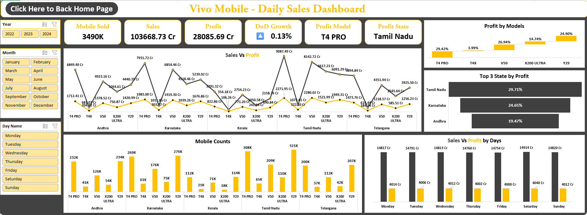
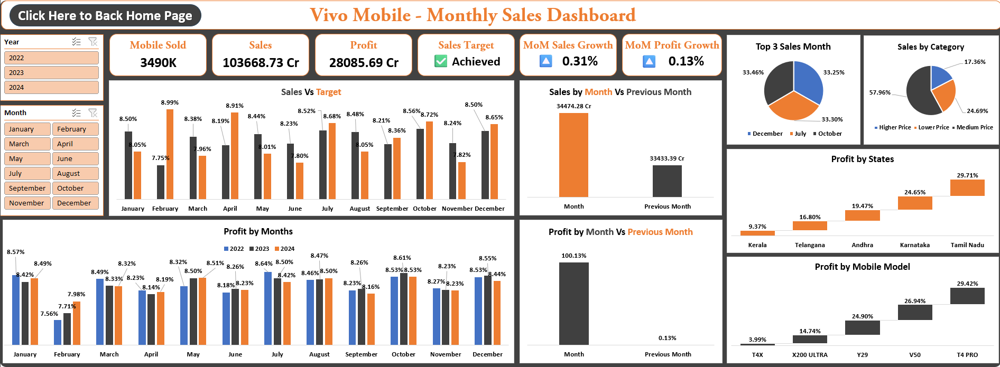
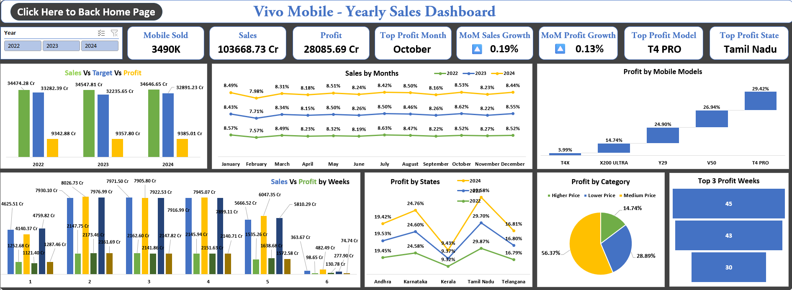

# Sales and Marketing Performance Analysis of Vivo Smartphones Using Excel
## 🌐 Live Dashboard

- Click Here to View Live Dashboard: [https://1drv.ms/x/c/ce8ecb681701e875/IQC0UCfdTIZpQ4fI6CicbJVsAUnkOudPtMhzxpmiHCLmlfo?e=ebsCgc]

---

## 📌 Project Overview
- Tool Used: *Microsoft Excel*
- Domain: *Mobile Marketing & Sales Analysis*
- Duration: *4 Days*
- Objective: *To analysis the Vivo mobile Sales Vs Profit Growth and Trends of*
  - Daily Report
  - Weekly Report
  - Monthly Report
  - Yearly Report

---

## ⏱️ Daily Sales Report

### 📊 Analysis
- 39L Mobile sold, 1.03L Cr sales, 28K Cr profit are happening in overall years.
- Saturday Achieved a highest number of sales & profit. 502K mobile sold, 14K Cr sales, 4K Cr Profit Made.
- T4 Pro & V50 are the medium Price Category Mobiles are made the 56% of total Profits.
- Tamil Nadu and Karnataka made a highest number of Profits.

### 📊 Conclusion
- Compare to Weekdays, Weekends Achieved a 4 to 6% of highest Sales and profit.
- Especially T4 Pro Mobile is the Highest sold model and Highest profit make in all states.
- Tamil Nadu is the Highest profit maker of all the states and the profits is 30%.

---

## 📝 Weekly Sales Report

### 📊 Analysis
- 2 & 3 Week made a highest number of sales and profits. Mobile sold is 805k, Sales is 23K Cr, Profits is 6.8K Cr.
- Tamil Nadu and Karnataka are the highest number of Total Sales and Profit maker states.
- T4 Pro & V50 are the medium Price Category Mobiles are made the 56% of total Profits.

### 📊 Conclusion
- Especially 2 weeks make the highest number of growths of all the Categories of all months and all years.

---

## 🗓️ Monthly Sales Report

### 📊 Analysis
- May, July, August, October, December is the most sales and profit month of all the years.
- In all these years February month is the low Sales and profits month and Fixed target is not achievable month.
- Tamil Nadu and Karnataka are the highest number of Total Sales and Profit maker states of all Months. And states contribute 55% of profit of all the months.
- T4 Pro & V50 are the medium Price Category Mobiles are made the 55% of total sales and Profits of the months in all years.

### 📊 Conclusion
- All the 3 years of data October month made a top sales and profit of all the months.
- 3 Quarter of the year made the high sales and profit of all the years.

---

## 📉 Yearly Sales Report

### 📊 Analysis
- Every Years profit is increasing only less than 1%.
- All the months are same like the previous Year months Sales and Profit. No big difference the result.
- Middle week of all the Months made the consistent Profit & sales of all the years.
- Weekend made the Relatively High Number of Sales & Profit in all the Years.
- Middle Price Category made the high number of Sales & Profit of all the Years. And the Profit percentage are 56% more similarly of all the years.
- Highest Sales & Profitable States is Tamil Nadu and Karnataka. And Highest Model sold is T4 PRO & V50.

### 📊 Conclusion
- There is no Big Difference in the Yearly Sales and Profit. All the 3 years of Profit is less than 1%.
- Introduce the New mobile model in Medium Price & Low-Price Category will make a considerable amount of High Sales and Profit of upcoming Years.
